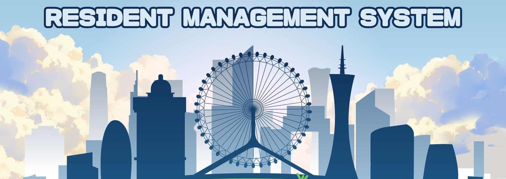

[Link website: Resident Management](https://huynq.site/ResidentManagement)
# 🚀Resident Management System


## 📖 Overview
The Resident Management System is a user-friendly platform that streamline the administration and management of residential address. It provides an efficient platform for area leader and police to oversee residents, track payments, manage resident requests, and enhance communication with residents

##  🔧Tech Stack

1. Frontend: JSP, HTML/CSS, Boostrap
2. Backend: Servlet
3. Database: MSSQL
4. Deployment: AWS Lightsail, Github Action, Docker
5. IAC: Terraform

## 🚀Getting Started
1. Clone the Repository
```sh
git clone https://github.com/HQuang123/ResidentManagement
cd ResidentManagement
```
2. Install Dependencies
Step 1: Download Tomcat 10.1
Step 2: Download Java JDK 17
Step 3: Download MSSQL version 2022

## 🤝Contributing

1. Fork the repo
2. Create a new branch (`git checkout -b feature-branch`)
3. Commit changes (`git commit -m "Added new feature"`)
4. Push to branch (`git push origin feature-branch`)
5. Create a Pull Request

## 📧 Contact
📩 Email: huynq00.hn@example.com  
💼 LinkedIn: [HuyNQ](www.linkedin.com/in/huyquang46/)  
